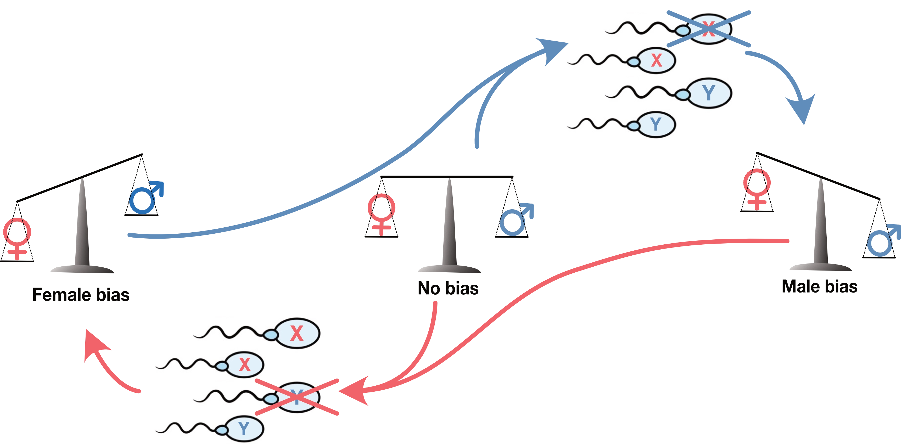
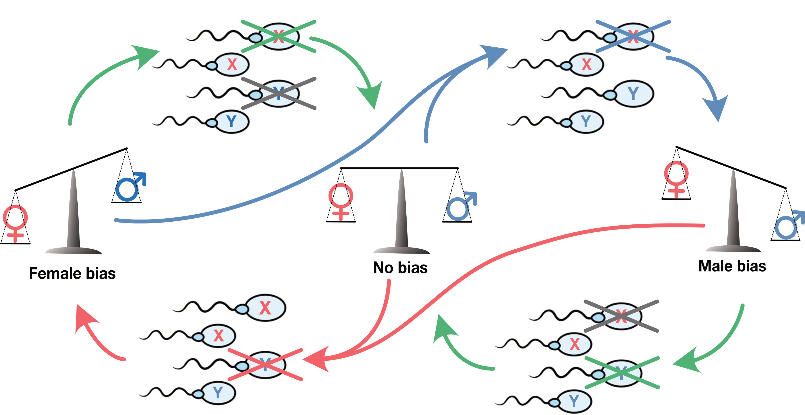

Our research addresses the evolutionary processes that give rise to the genetic diversity of present-day species. We develop theory and computational methodologies and analyze shared ancestry across large numbers of human and primate genomes. We focus on the unique processes governing sex chromosome evolution and how these may help explain both reproductive isolation of emerging species and the role sex plays in neurodevelopment.

<b>Sex-chromosome meiotic drive:</b> Unlike the 22 chromosome pairs that carry the same genes and exchange gene variants before they separate into sperm cells, the X and Y sex chromosome evolve separately from each other making them evolutionary rivals. If an X gene variant can impair Y-bearing sperm the proportion of X carrying sperm will rise above 50% giving the man more daughters than sons. Since this gene variant transmits more gene copies to the next generation than variants that do not impair Y-bearing sperm, it spreads through the population. We call this "meiotic drive" but it is really just natural selection with the twist that it benefits only the "X-driving" gene variant. An X-driver need not invent any novel function. It just needs a mutation that breaks some cellular function in a way that is slightly worse for the Y-carrying sperm. Just like X drivers, an Y-driver will promote the transmission of Y chromosomes, setting up a arms race between X and Y for the control of the transmission ratio.

<b>The pull to even sex ratio:</b> As a driver makes the one sex more common, any gene variant that pull in the opposite direction be strongly favored by selection. Since all individuals in the new generation needs a parent of each sex, children of the rarer sex will take part in more unions and thus produce more grandchildren. Since this is old-fashioned Darwinian selection, any of the all the 20,000 genes across the non-sex-chromosomes (the autosome) may contribute such variants. The rarer one sex is, the stronger the selection on variants skewing the X/Y ratio of sperm in the opposite direction. The result is a three-way arms race: A tug-of-war between X and Y (red and blue arrows) and the remaining genome doing its utmost not let anyone win (green arrows).

<b>Collateral damage:</b> The transmission advantage of X and Y drivers, and the fitness advantage of opposing variants across the autosome ratio-restoring of genes  of a driver easily outweighs moderate harm to the organism’s fitness, continually compromising not only spermatogenesis, but also the other tissues in which the driver genes are expressed. Assuming an even sex-ratio, the net transmission of a driver variant equals its segregation ratio multiplied by its effect on organismal fitness. A driver carried by 60% of sperm cells and reduces fitness by 5% still transmits at 57%, compared with 50% for a non-driver variant of the same gene. This corresponds to a selection coefficient of 14%, comfortably exceeding the 10% attributed to lactase persistence, the positive selection documented in humans. The collateral damage is not limited to the driver genes and restoring autosomal genes. A strongly selected driver or restoring variant spreads rapidly in what is called a “selective sweep” where it drags along all physically linked variants. Variants in the genomic neighborhood will thus hitchhike to higher frequency, even if moderately deleterious.

Compromised neurodevelopment: More than 90% of our brain genes are also expressed during spermatogenesis, potentially exposing them to the side effects of intra-genomic conflict. 

<!-- **Recurrent selective sweeps on the X-chromosome:** Our studies on 

As a strongly selected gene variant displaces all other variants in a population, it drags with it the genomic region around it. The selective sweep thus “sweeps” genetic variation as the haplotype carrying the selected variant displace all others. We identify selection in the recent 50-100 thousand years by looking for genomic regions sharing ancestry centering on a recent mutation.

To address the accumulated effect of recurrent sweeps across millions of years, we look for such ancestry sharing across the primate species tree. 

Due to the rapid succession of bifurcations in the species tree, the individual gene trees along the genome are interspersed with gene trees not conforming to the species tree, except for regions where selective sweeps occurred. 

Modelling of this phenomenon (called Incomplete Lineage Sorting)

evolutionary time scales across sweeps in the species ancestral to humans and other living primates. To this end we employ methods based on patterns of incomplete lineage sorting, which are able to identify strong selective sweeps or regions subject to recurrent selective sweeps. 

 **Meiotic Sex chromosome Inactivation (MSCI):** During meiosis and the following haploid stages of spermatogenesis, 

**Epigenetic battlegrounds:** 

**Autism and the Y-chromosome:** 

**Hybrid incompatibility:** Our work on baboon admixture has revealed -->