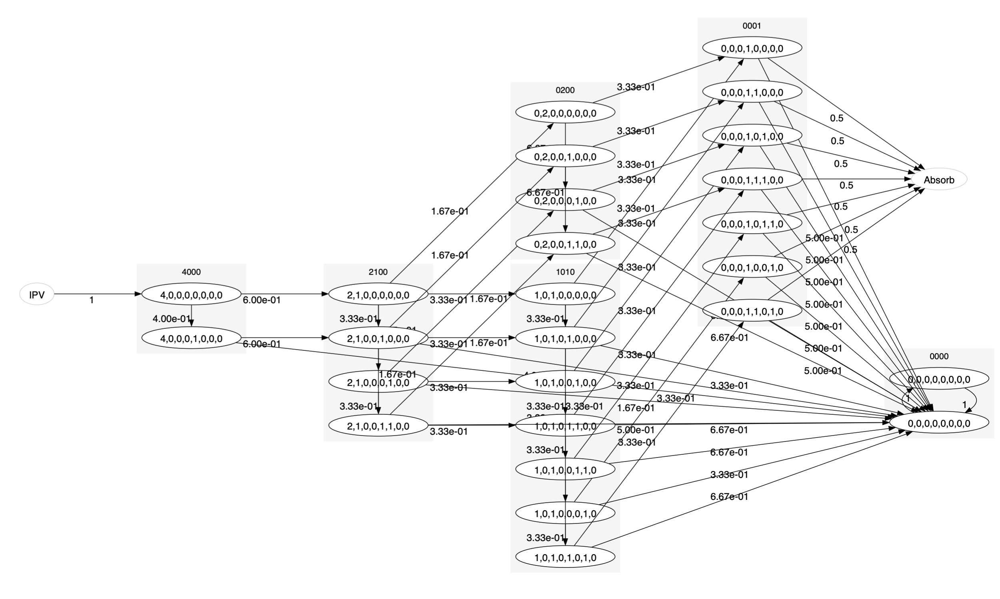

<section class="tiles">
  <article class="style1">
    
      
    
    <a href="research">
      <h2>Sex-chromosome meiotic drive</h2>
      

        
We model and analyze patterns of genetic diversity across populations of humans and other primates — with a special focus on sex chromosome evolution.

      

    </a>
  </article>
  <article class="style2">
    
      
    
    <a href="research">
      <h2>Sex chromosomes and autism</h2>
      

        
Exploring how intragenomic conflicts in spermatogenesis shape the genetic basis of autism spectrum disorders.

      

    </a>
  </article>
  <article class="style3">
    
      
    
    <a href="research">
      <h2>Hybrid incompatibility</h2>
      

        
Investigating how meiotic drive fuels reproductive barriers between diverging populations of primates.

      

    </a>
  </article>
  <article class="style4">
    
      
    
    <a href="research">
      <h2>Population genetic modeling</h2>
      

        
Developing graph-based phase-type distributions for computing population genetic quantities.

      

    </a>
  </article>
  <article class="style5">
    
      
    
    <a href="software">
      <h2>Research software</h2>
      

        
Applications and libraries for computation, analysis and visualization. All MIT licensed and available as conda packages.

      

    </a>
  </article>
  <article class="style6">
    
      
    
    <a href="open_research">
      <h2>Open research</h2>
      

        
Trust, transparency, sharing and collaboration. We share our progress and ideas openly.

      

    </a>
  </article>
</section>
