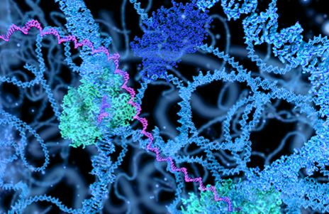

  

    
  

  

    <h2>Sex-chromosome meiotic drive</h2>
    
All lines of research in our group address either the causes or consequences of the unique way natural selection controls sex chromosome evolution. We model and analyze patterns of genetic diversity across populations of humans and other primates — with a special focus on sex chromosome evolution.

    <a href="research">Learn more &rarr;</a>
  

  

    
  

  

    <h2>Research software</h2>
    
As means to address research questions, we produce applications and programming libraries for computation, analysis and visualization. They are all MIT licensed and made available as conda packages. Use them in any way that generates value, be that scientifically or commercially.

    <a href="software">Learn more &rarr;</a>
  

  

    
  

  

    <h2>Open research</h2>
    
The pace of scientific advance is best supported by trust, transparency, sharing and collaboration. We share our progress and ideas in the hopes that others reach out to contribute, collaborate, or to inherit pilot projects and ideas.

    <a href="open_research">Learn more &rarr;</a>
  

<section class="landing-section">

<h2>Research areas</h2>

  

    
    

      <h3>X chromosome hybrid incompatibility</h3>
      
Investigating how meiotic drive fuels reproductive barriers between diverging populations of primates.

    

  

  

    
    

      <h3>Sex chromosome evolution and autism</h3>
      
Exploring how intragenomic conflicts in spermatogenesis shape the genetic basis of autism spectrum disorders.

    

  

  

    
    

      <h3>Selection on chromatin architecture</h3>
      
Studying how natural selection acts on chromatin organization during spermatogenesis.

    

  

  

    
    

      <h3>Population genetic modeling</h3>
      
Developing graph-based phase-type distributions for computing population genetic quantities.

    

  

</section>
