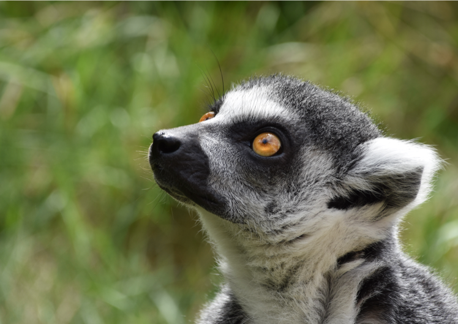

<!-- Banner -->
<section id="banner">

<h2>{{ site.title }}</h2>

{{ site.description | markdownify }}

<!--
	<ul class="actions special">
		<li><a href="joinus.html" class="button special">Postdoc position available</a></li>
	</ul>
 -->

<a href="#one" class="more scrolly">Learn More</a>
</section>

<!-- One -->
<section id="one" class="wrapper style1 special">

<header class="major"> 
<h2>Bioinformatics Research Centre, MBG, Aarhus University</h2>

We are computational biologists analyzing and modelling the fundamental mechanisms of evolution to better understand how these affect species formation and human health

</header>

	<ul class="icons major">
	<li><a href="people.html" style="border-bottom-color: transparent;">People</a></li>
	<li><a href="http://www.birc.au.dk" style="border-bottom-color: transparent;">Aarhus University</a></li>
	<li><a href="mailto:kaspermunch@birc.au.dk" style="border-bottom-color: transparent;">Email</a></li>
	</ul>

</section>

<!-- Two -->
<section id="two" class="wrapper alt style2">
<section class="spotlight">

<h2>Research</h2>
We study genetic diversity to understand evolution. <a href="research.html">Read more...</a>

</section>
<section class="spotlight">

<h2>Software</h2>
We make computational approaches available as scientific software. <a href="software.html">Read more...</a>

</section>
<!-- <section class="spotlight">

<h2>Popular science</h2>
When possible, we write about our work for wider audience. <a href="popular_science.html">Read more...</a>

</section> -->
</section>

<!-- Three -->
<section id="three" class="wrapper style3 special">

<header class="major">
<h2>Recent publications</h2>
<!-- 
See the full list of publications <a href="publications.html">here</a>.
 -->
</header>
<ul class="features">
<li class="icon fa-newspaper-o">
<h3>Genome-wide coancestry reveals details of ancient and recent male-driven reticulation in baboons</h3>
Read it in <a href="https://www.science.org/doi/10.1126/science.abn8153">Science</a>.
</li>
<li class="icon fa-newspaper-o">
<h3>Versatile detection of diverse selective sweeps with Flex-sweep</h3>
Read it in <a href="https://academic.oup.com/mbe/article/40/6/msad139/7194669">Molecular Biology and Evolution</a>.
</li>
</ul>

</section>

<!-- CTA -->
<section id="cta" class="wrapper style4">

<header>
<h2>News and Press</h2>

News from the group - big and small

</header>
<ul class="actions vertical">
<li></li>
<li><a href="news.html" class="button fit">View News</a></li>
</ul>

</section>
