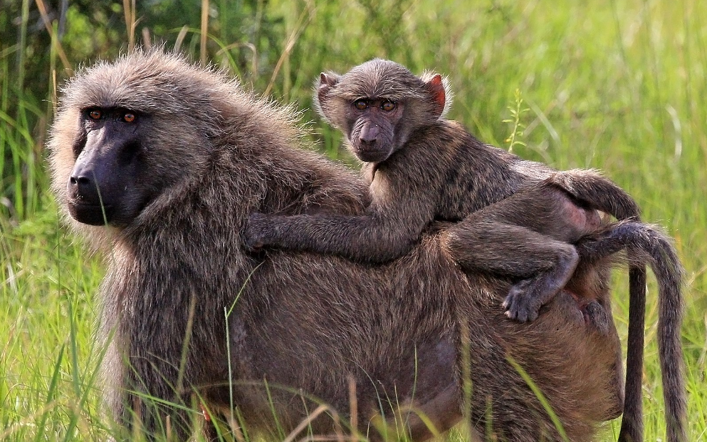
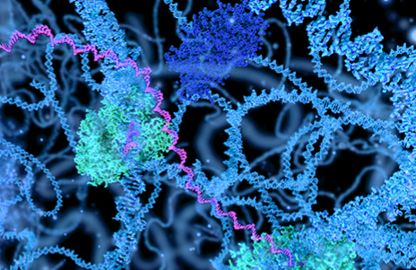
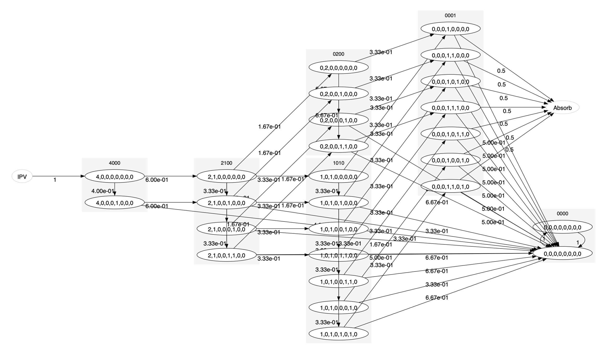

<!-- One -->
<section id="one" class="wrapper spotlight style1">
	

		
		

			<h2 class="major">Sex-chromosome meiotic drive</h2>
			
All lines of research address either the causes or consequences of the uniqiue way natural selection constrol sex chromosome evolution - acts strong selection In our research, we model and analyze patterns of genetic diversity across populations of human and other primates - with a special focus on sex chromosome evolution.

			<a href="#four" class="special">Learn more</a>
		

	

</section>

<!-- Two -->
<section id="two" class="wrapper alt spotlight style2">
	

		
		

			<h2 class="major">Research software</h2>
			
As means to address research questions, we produce applications and programming libraries for computation, analysis and visualization. They are all MIT licensed and made available as conda packages. Use them in any way that generates value, be that scientifically or commercially.
		
			<a href="#" class="special">Learn more</a>
		

	

</section>
 
<!-- Three -->
<section id="three" class="wrapper spotlight style3">
	

		
		

			<h2 class="major">Open research</h2>
			
The pace of scientific advance is best supporteed by trust, transparency, sharing and collaboration. We share our progress and ideas in the hopes that others reach out to contribute,  and collaborate, or to inherrit pilot projects and ideas.

			<a href="#" class="special">Learn more</a>
		

	

	<!-- 

		
		

			<h2 class="major">Join our extended family</h2>
			
Please let us know if you would like to contribute to any or our research projects - or if you would like help raising funds to come joins us in Denmark.

    		<a href="#" class="special">Learn more</a>
    	

    
 -->
</section>

<!-- Four -->
<section id="four" class="wrapper alt style1">
	

		 
		<h2 class="major">Research areas</h2>
		
Cras mattis ante fermentum, malesuada neque vitae, eleifend erat. Phasellus non pulvinar erat. Fusce tincidunt, nisl eget mattis egestas, purus ipsum consequat orci, sit amet lobortis lorem lacus in tellus. Sed ac elementum arcu. Quisque placerat auctor laoreet.

		<section class="features">
			<article>
				
				<h3 class="major">X chromosome hybrid incompatability</h3>
				
Lorem ipsum dolor sit amet, consectetur adipiscing vehicula id nulla dignissim dapibus ultrices.

				<a href="#" class="special">Learn more</a>
			</article>
			<article>
				
				<h3 class="major">Sex chromosome evolution and autism</h3>
				
Lorem ipsum dolor sit amet, consectetur adipiscing vehicula id nulla dignissim dapibus ultrices.

				<a href="#" class="special">Learn more</a>
			</article>
			<article>
				
				<h3 class="major">Selection on chromatin architecture</h3>
				
Lorem ipsum dolor sit amet, consectetur adipiscing vehicula id nulla dignissim dapibus ultrices.

				<a href="#" class="special">Learn more</a>
			</article>
			<article>
				
				<h3 class="major">Population genetic modeling using phase-type distributions</h3>
				
Lorem ipsum dolor sit amet, consectetur adipiscing vehicula id nulla dignissim dapibus ultrices.

				<a href="#" class="special">Learn more</a>
			</article>
			<!-- <article>
				
				<h3 class="major">Sex chromosome meiotic drive</h3>
				
Lorem ipsum dolor sit amet, consectetur adipiscing vehicula id nulla dignissim dapibus ultrices.

				<a href="#" class="special">Learn more</a>
			</article>
			<article>
				
				<h3 class="major">Recombination map evolution</h3>
				
Lorem ipsum dolor sit amet, consectetur adipiscing vehicula id nulla dignissim dapibus ultrices.

				<a href="#" class="special">Learn more</a>
			</article> -->
		</section>
		<ul class="actions">
			<li><a href="#" class="button">Browse All</a></li>
		</ul>
	

</section>
