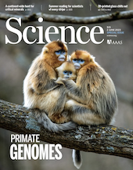
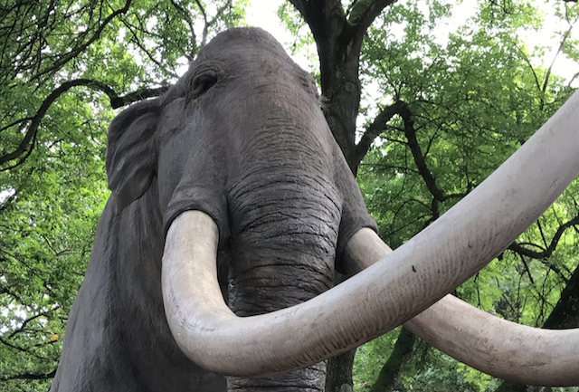
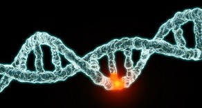
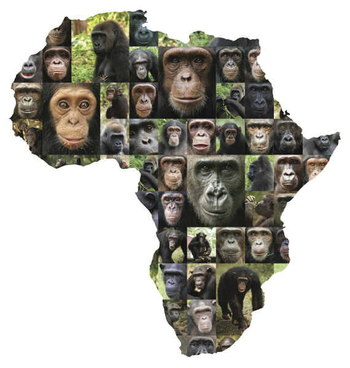
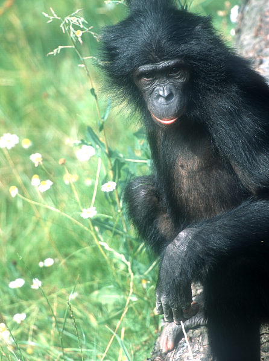
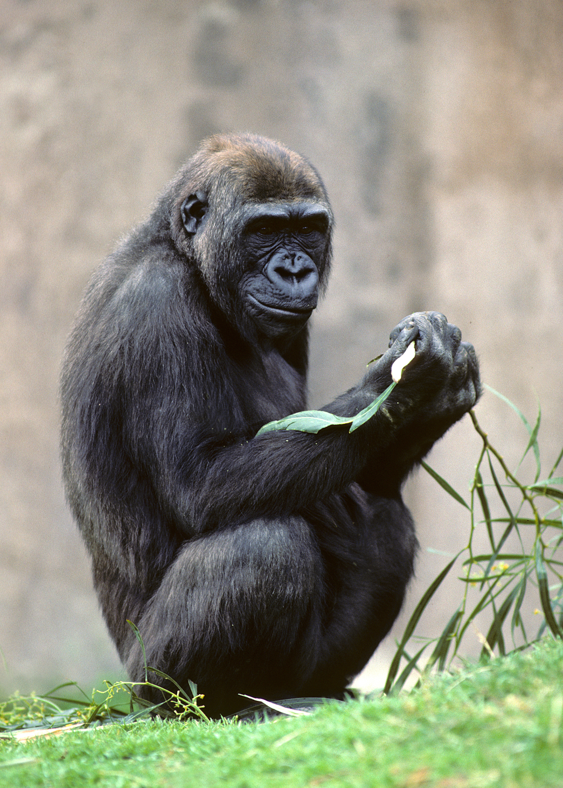
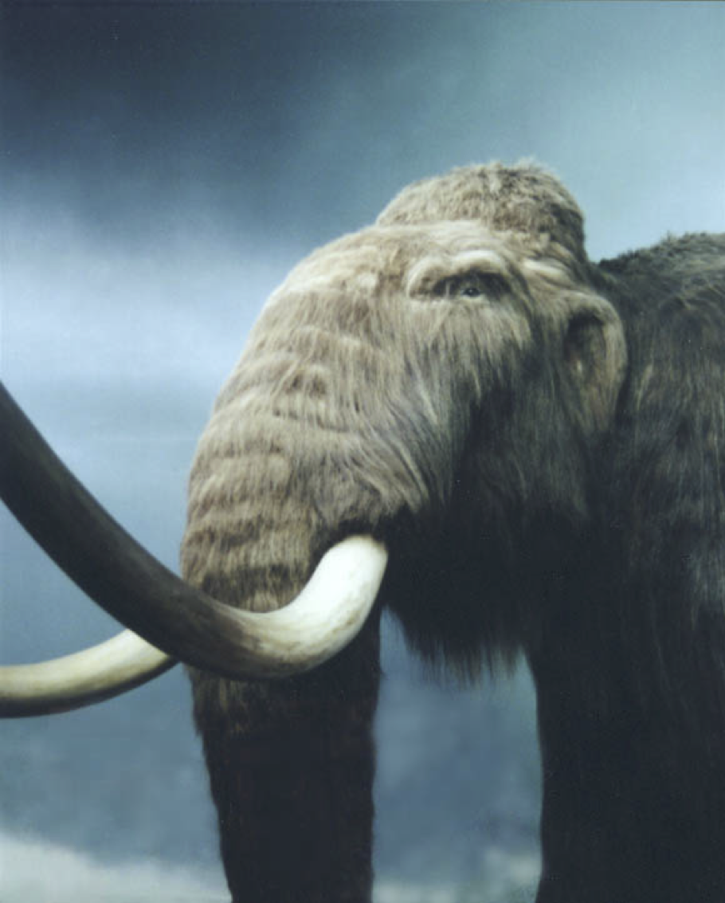

## The Science special issue with two papers from the group

{: .img-right}

Detailed account of baboon interspecies relationship with Ph.D. student Erik Fogh as shared first author.

*--- June 2, 2023*
{: .news-date}

## John Hawks writes about our recent work on human X chromosomes

> **Could meiotic drive explain why Neandertal ancestry is so sparse on the X chromosome?** New research provides a surprising insight into the out-of-Africa dispersal, which may change how we think about Neandertals and Denisovans.

Read the full article [here](https://johnhawks.net/weblog/positive-selection-x-chromosomes-recent-human-evolution/)

*--- March 11, 2023*
{: .news-date}

## An X file -- the truth is out there

Tracing my ancestry into the past spreads my genes thinly across ancestors as these double generation by generation. Each gene thus travels a separate line of ancestors that serve as vessels carrying it through the ages. The only genes I *can* have are ones that successfully made it from one generation to the next. That is all there is to natural selection. It works on genes, not organisms. Organisms are just vessels, and their fitness only comes into the picture because a gene's contribution to better organism fitness helps the gene get passed to more new vessels in the next generation. If a gene could somehow pass to more new vessels while *reducing* organism fitness and fertility, it would not break the logic of natural selection. Strange as it may seem, this actually happens.

I have two copies of each chromosome except the X chromosome, which only women carry in pairs. My X chromosome instead pairs up with a small Y chromosome. Unlike other pairs of chromosomes, the X and Y chromosomes do not mix their genes before each one ends up in a sperm cell. So if a gene on the X chromosome can somehow reduce the viability or motility of the sperm cells with Y chromosomes, it will pass to more offspring in the next generation. Killing off sperm cells reduces fertility and skews the sex ratio of children, reducing the individual's fitness. Yet, the advantage enjoyed by the selfish gene variant may be so big that it more than makes up for the lower fitness of the organism that carries it. The phenomenon is called meiotic drive, but it is natural selection nonetheless. Researchers of model organisms have found this particular kind of selection in mice and fruit flies but, so far, not in humans.

In a project we publish today in [Cell Genomics](https://doi.org/10.1016/j.xgen.2023.100274), we report genetic evidence of strong selection along the human X chromosome. When a selected gene spreads through a population, dragging its genomic neighborhood along, it "sweeps" away genetic diversity around it. Using comparative genome analysis, we searched for such "selective sweeps" on the X chromosomes of human males worldwide. We found 14 sweeps shared by all non-African populations, suggesting that this selection happened after the main migration out of Africa but before the subsequent spread of people across Eurasia (using ancient DNA, we narrowed this interval to 55,000-45,000 BP). Surprisingly, the swept regions do not have the small segments of Neanderthal DNA, which otherwise spread across non-African genomes. This absence suggests that the selected gene variants were all introduced from a contemporary human population not exposed to Neanderthal admixture. Although the mechanism of this strong selection remains unknown, it must be unique to the X chromosome. The working hypothesis guiding our continued effort is that it is indeed a meiotic drive.

*--- Feb. 28, 2023*
{: .news-date}

## Research covered by New Scientist

New Scientist [writes about the strong selection](https://www.newscientist.com/article/2348335-modern-humans-evolved-a-selfish-x-chromosome-after-africa-exodus/) we find on the X chromosome of non-Africans. The title is pushing it though.

*--- Nov. 23, 2022*
{: .news-date}

## What are you waiting for?

{: .img-right}

Imagine standing on the bank of a stream, trying to spot a sequence of stepping stones that will take you to the other side without getting your feet wet. In your imagination, you draw lines between stepping stones close enough to jump between. The connected stones create a network of many alternative paths connecting the two banks. Standing on one stone with more than one other stone to jump to, you probably prefer some over others, and you will tend to linger for longer if the next jump seems demanding. Having assessed the difficulty of jumps in a network of connected stones, you will know roughly how long the crossing is expected to take. What you just made in your head is called a phase-type distribution.

Phase-type distributions describe the time it takes to proceed through a series of connected states until whatever state constitutes the end. This applies to a vast range of situations, as you can probably imagine. For example, phase-type distributions describe everything from stream crossings to the patterns of relatedness among DNA sequences. The properties of phase-type distributions are well described using matrix algebra. However, their practical use has been limited because matrix computations are too slow to cope with many transient states. In other words, if the number of states is large, it takes so long to compute the expected time that no one cares to try.

In the paper published today in [Statistics and Computing](https://link.springer.com/article/10.1007/s11222-022-10174-3), we present a set of algorithms that treat phase-type distributions as a network or graph just like the stepping stone example. This lets us compute many phase-type distributions orders of magnitude faster than before, greatly expanding their use. Whatever it is you are waiting for, chances are that the wait is phase-type distributed. Now it can be computed while you wait.

*--- Nov 1, 2022*
{: .news-date}

## SAP lives forever

The assignment of DNA from organic material to species or taxonomic groups is integral to a number of scientific disciplines. Metagenomics is an approach particularly suitable for viruses and bacterial species, which have a relatively small genome. The approach can be used to characterize environments according to their genetic fingerprint. Even without taking genomic approaches, however, DNA sequencing of selected markers from environmental samples may provide ecological information or identify relevant species such as human pathogens. A related field where unknown specimens are identified based on Cytochrome Oxidase I (COI) has become known as DNA Barcoding. SAP is a tool to answer the central question in these fields: what taxonomic group does an unknown organism represented by a DNA sequence belong to? SAP uses a Bayesian approach to calculate a probability distribution over all taxa represented in a sequence database. The probability of assignment to each taxon serves as a measure of confidence in the assignment. SAP is available as both a [command line tool](https://services.birc.au.dk/sap/downloads) and a [web service](http://services.birc.au.dk/sap). Thanks to clever containerization technology that was not available when SAP was published, the SAP program is now available as a [docker image](https://hub.docker.com/repository/docker/kaspermunch/sap) for hassle-free installation on all platforms.

*--- Oct 3, 2021*
{: .news-date}

## Evolution and domestication of the lama and alpaca

The paper on domestication and post-Spanish conquest evolution of the llama and alpaca is out in Genome Biology.

*--- July 2, 2020*
{: .news-date}

## Spotlight

David Castellano's paper on the distribution of fitness effects in the great apes is chosen by Genetics for their yearly spotlight publication.

*--- Feb 7, 2020*
{: .news-date}

## Funding from the Novo Nordisk Foundation

The group was awarded 2.5 million DKK from the Novo Nordisk Foundation. The sequencing of full genomes from thousands of humans allows us to revisit the gene-centric view of evolution popularized by Richard Dawkins in his 1976 book "The Selfish Gene". The funded research will address the fundamental question: how does the selfishness of human genes influence genome evolution, cellular function, and human health? Selfish genes in other organisms are found on sex chromosomes. They act by distorting male meiosis and spermatogenesis. This distortion results in an uneven proportion of sperm that carry each sex chromosome and may result in partial or full infertility. Selfish genes may thus be promoted by natural selection, even if harmful to the organism. We believe that selfish genes can account for unexplained patterns of human genetic diversity on the X chromosome. We use computer simulations and analysis of full genomes worldwide to identify candidate selfish genes involved in sex chromosome evolution and male fertility.

*--- Nov 29, 2019*
{: .news-date}

## Distribution of fitness effects in the great apes

David Castellano's paper on the distribution of fitness effects in the great apes is out in Genetics.

*--- Nov 1, 2019*
{: .news-date}

## Mutation rate and selection in the homininae

David Castellano's paper on how mutation rate and selection are linked to shape diversity in humans and other homininae is out in Genome Biology and Evolution.

*--- Oct 19, 2019*
{: .news-date}

## Elephants and the mesh of life

{: .img-right}

The evolution and diversification of life are nicely depicted by a tree -- with the original first living organism at the root and the main branches splitting into still smaller branches and twigs that eventually lead to the living species at the leaves. But what about all the species that went extinct, you may ask? The dinosaurs found themselves in dire straits 65 million years ago. In fact, species go extinct all the time. Whereas recently emerged species most likely persist, species that arose hundreds of million years ago have most likely gone extinct since then. This continuously removes twigs and branches from the tree of life, which is why it has ended up looking like, well, a tree.

Elephants are an excellent example of a group of species where some have gone extinct, and others have not. There are three living species: the Asian elephant and the forest and savanna elephants in Africa. However, we would only need to travel back 100,000 years to meet another three species of elephants: The straight-tusked elephant, the woolly mammoth, and the Colombian mammoth. Fortunately, it has been possible to obtain enough DNA from the bones of these extinct species so that their genomes can be sequenced. Over the past year or so, I have been part of an effort led by the excellent Elle Palkopoulou to analyze the full genomes of individuals from these six species.

In the study we published in PNAS today, we show that the species tree that relates these six species is crisscrossed by connections between the branches, making it look more like a mesh than a tree. When one species split into two, they diverge only slowly, and it seems to take at least a couple of million years to accumulate enough genetic differences that hybrids are no longer fertile. Until then, hybridization may happen, transferring genes from one species to another. The most important finding in the paper is that elephant species hybridized extensively even a long time after they initially split apart. The most prominent example is the straight-tusked elephant (the model in the picture). Most of its genes can be traced back to the initial split from the ancestor to African elephants, but a large proportion is derived from hybridization with forest elephants and with Mammoths. As more species groups are studied using full genomes, we will see many more examples where hybridizations and even fusions of species make the species tree look more like a mesh than a tree.

*--- Feb. 26, 2018*
{: .news-date}

## Waiting for good mutations

{: .img-right}

We know intuitively that individuals from small isolated populations are often more related with each other than individuals in large populations are. Whereas closely related individuals have a shared relative in the recent past, distantly related individuals will have to look back many, many generations to find such a common ancestor. This leaves more time for genomic mutations to produce differences between the two individuals, and this is why individuals from large populations show more differences between their genomes than individuals from a small one do.

So, large population size goes hand in hand with large genetic diversity. Species are isolated populations because they do not interbreed with the populations of other species. Among the great apes, bonobos and chimpanzees exhibit the least genetic diversity. Gorillas have larger populations and higher diversity, only superseded by orangutans.

In each species, the genetic diversity is not even across the genome. Some regions of the genome have lower diversity because natural selection removes harmful mutations in regions, such as genes, of particular importance to the organism. This produces a landscape of higher and lower diversity that is shared between the great apes because the genes and other important regions are located in roughly the same places.

Temporary differences in this landscape of diversity may arise from adaptation events. Once in a while, a beneficial mutation comes along, which gives the individuals that carry it an advantage in natural selection. When such a mutation quickly spreads to the entire species, the mutation and the region around it become shared by all individuals, which depletes genetic diversity in that part of the genome. Such depletions in diversity are called "selective sweeps" and supply evidence of how often new beneficial mutations are introduced. In a paper published in PNAS today, we use this principle to show that larger populations seem to experience such sweeps more often than small ones: orangutans more so than gorillas more so than chimpanzees and bonobos. We think this reflects that adaptation is limited by how often good mutations arise in the population. If twice as many good mutations happen in a population with twice as many individuals, then twice as many sweeps should occur.

It turns out that humans are the great apes with the slowest rate of sweeps. This may seem odd, considering that we are six billion people. The reason is humans only multiplied in the last ten thousand years or so, a mere blink of an eye to evolution. In the rest of our history, we were only a small crowd. -- But maybe, from now on, we will not have to wait so long for the good mutations.

*--- Jan. 30, 2017*
{: .news-date}

## Selective sweeps across twenty million years of primate evolution

Our paper in MBE shows how patterns of incomplete lineage sorting measures linked selection on evolutionary timescales. We show that a large portion of linked selection is due to selective sweeps and that the human-chimpanzee ancestor experienced a substantially higher frequency of sweeps than did the human-orangutan ancestor. These ancestral sweeps are enriched for sweeps in modern humans suggesting that several regions of the genome are repeatedly hit by sweeps.

*--- Sept. 22, 2016*
{: .news-date}

## Great ape genetic diversity mapped

{: .img-right}

The genomes of the great apes have been sequenced with the Gorilla and Bonobo genomes completing the picture last year. This gave us valuable new information about the patterns of genetic differences between humans and the other great apes and a detailed picture of the ancestral relationship of this group of species.

Until now, however, we have lacked a comparable account of the differences of individuals within each species. As part of an international collaboration, today in Nature, we publish a deep survey of the species' genetic diversity and subspecies of great apes. This shows that several of the apes, including the Orangutan, have genetic diversities that dwarf humans: where two humans show one difference for each thousand positions in the genome, the orangutan sports two. The larger genetic diversity of apes allows us to peek further into these species' evolutionary past to understand better the mechanisms shaping genomes as species evolve. The close relationship of humans and the other great apes means that a better knowledge of these processes will also over time contribute a better understanding of human evolution. Among other results, analysis of the 78 genomes sequenced in this study has produced the first full picture of great ape evolution, integrating within-species history with the more ancient history of how these species arose from common ancestors.

Knowledge of the patterns of diversity is also crucial in distinguishing the different subspecies of Chimpanzees, Gorillas, and Orangutans and will aid zoos in planning breeding programs to keep separate the different subspecies in captivity and thereby conserve their characteristics.

*--- July 25, 2013*
{: .news-date}

## Bonobo genome shows that bonobos and chimpanzees resemble us in separate ways

{: .img-right}

Most people think that the chimpanzee alone is our closest relative, but in fact there is a second ape, the bonobo, that we are just as related to. Humans split from the other apes 5-6 million years ago, and only 1-2 million years ago, the ancestors of bonobos and chimpanzees split into these two species. This likely happened when the Congo River formed, separating the two species -- chimpanzees and bonobos -- that do not swim. Bonobos live south of the river in the Democratic Republic of Congo.

Although darker and more slender than chimpanzees, they are similar in appearance, but they differ strikingly from chimpanzees in social and sexual behavior. In chimpanzees, males are the dominant sex, and hierarchy and conflict resolution are based on aggression. In bonobos, females are dominant, hierarchy is based on the mother's status, and conflicts are resolved through sex. These strikingly different behavioral characteristics have made scientists dub the bonobo "the hippie ape" and "the make love not war ape". Our collaborators at the Max Planck Institute for Evolutionary Anthropology in Leipzig tell us that if they throw a toy into a chimpanzee cage, the chimpanzees will fight over it, leaving the winner to play with it alone. If it is thrown into a bonobo cage, everyone will have sex and then share the toy. Several of the social and sexual traits that are only found in one of these apes are also found in humans. The frequent non-conceptive sexual behavior is thus shared with humans but not with chimpanzees, lethal aggression is found in chimpanzees and humans but not in bonobos, humans and bonobos are very playful whereas chimpanzees are less so, and chimpanzees and humans apply cooperative hunting whereas bonobos do not.

Today, the bonobo genome is published in Nature, revealing a detailed account of our relation to bonobos and chimpanzees. The genomic DNA was obtained from the female bonobo Ulindi from Leipzig Zoo while she was anesthetized anyway by the dentist. The Bioinformatics Research Centre has participated in the bonobo genome consortium. I have led an effort to contribute a bioinformatic analysis of the bonobo genome, the results of which define the paper's topic published today. The bioinformatical approach we apply is unique because it combines the genetics analysis within species with the genetics between species, combining these two traditionally separated fields into one model.

Comparing the bonobo genome to the already known genomes of humans and chimpanzees we have shown that for some parts of the genome (about 3%) it is not bonobos and chimpanzees that are most similar but humans and bonobos or humans and chimpanzees. This patchwork of genetic relatedness results because the three species are so closely related that they may share genes inherited from the common ancestor of all three species. 25% of our protein-coding genes have parts that are more similar to bonobo or chimpanzee than these are to each other. Future research may reveal if these genes are responsible for traits we only share with one of these apes. A candidate could be the TAAR8 gene, which only shares a variant between humans and bonobos. The gene codes for a protein receptor that is known to help mice smell amines in urine and may provide social cues in bonobos.

*--- June 13, 2012*
{: .news-date}

## Gorilla genome reveals our ancestry as genetic patchwork

{: .img-right}

The chimpanzee is our closest cousin in the tree of life. Humans and chimpanzees split into separate species about 5-6 million years ago. The gorilla is more remotely related to both humans and chimpanzees, separating about 8 million years ago. Today, the Gorilla genome is published in Nature, revealing surprising properties of our own genetic history. As expected, most of our genes are similar to the ones of the chimpanzee, but it turns out that many of our genes are more like gorilla genes than chimpanzee genes. The genetic material on chromosomes is mixed in sexual reproduction, freeing each gene to follow its own path through evolution. Because humans, chimpanzees, and gorillas are closely related, this results in a mix of genes with different relatedness. For most genes, humans and chimpanzees are most related, but 15% of chimpanzee genes are more related to the gorilla than to our genes, and 15% of our genes are more related to gorillas than to chimpanzees.

We have elucidated this genetic patchwork that reflects the evolutionary history of humans, chimpanzees, and gorillas. Analyzing these patterns has allowed us to firmly establish how important natural selection is to the evolution of these species. They find that the genetic variation is smaller in genes than the genome average because natural selection removes mutations that disrupt gene function. Our bioinformatical approach is unique because it combines the genetics analysis within species with the genetics between species, combining these two traditionally separated fields into one model. Our analyses also illuminate how western and eastern gorillas split into separate sub-species. Although we commonly think of such speciations as happening at a distinct point in time, this does not always reflect reality. This study shows that the separation into western and eastern gorillas happened over an extended period of time.

*--- March 7, 2012*
{: .news-date}

## No magic bullet explains Ice Age megafauna extinctions

{: .img-right}

Was it humans or climate change that caused the extinctions of the iconic Ice Age mammals (megafauna) such as the woolly rhinoceros and woolly mammoth? For decades, scientists have debated the reasons behind these enigmatic Ice Age mass extinctions, which caused the loss of a third of the large mammal species in Eurasia and two-thirds of the species in North America. In an extensive, interdisciplinary research collaboration involving over 40 academic institutions worldwide, we have tried to tackle the contentious question in the biggest study of its kind. As so often in science, the answers are far more complicated than imagined. The study, published online in Nature, reveals that neither climate nor humans alone can account for the Ice Age mass extinctions. Using ancient megafauna DNA, climate data, and the archaeological record, the findings indicate dramatically different responses of Ice Age species to climate change and humans. For example, the study shows that humans played no part in the extinction of the woolly rhino or the musk ox in Eurasia and that their demise can be entirely explained by climate change. On the other hand, humans aren't off the hook when it comes to the extinction of the wild horse and the bison in Siberia. Our ancestors share responsibility for the megafauna extinctions with climate change. While the reindeer remain relatively unaffected by any of these factors, the causes of the extinction of the mammoths are still a mystery. Despite the unparalleled amount of data analyzed in this study, we find no clear pattern distinguishing species that went extinct from species that survived, suggesting that it will be extremely challenging for experts to predict how existing mammals will respond to future global climate change.

*--- Dec. 29, 2009*
{: .news-date}
