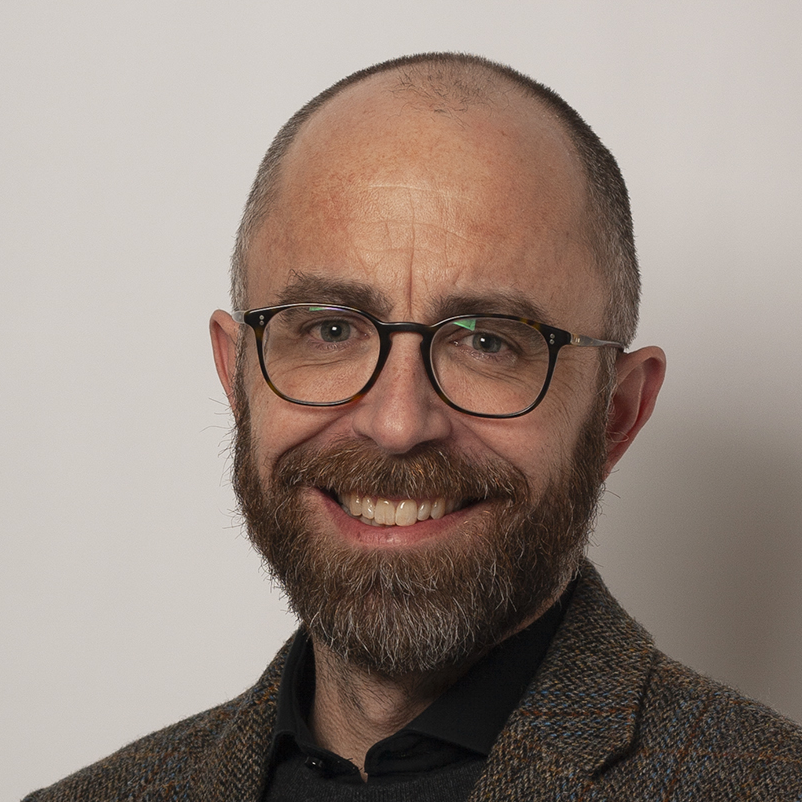
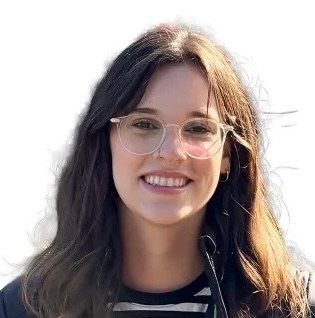
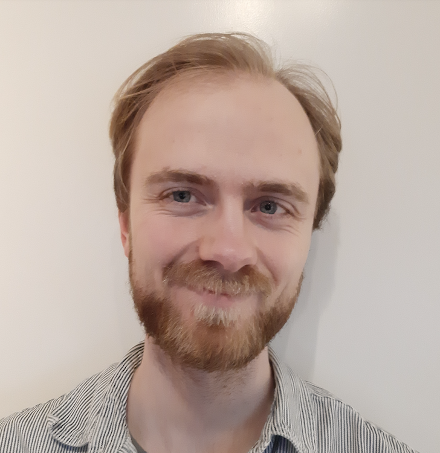
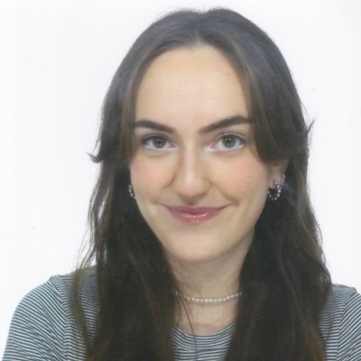
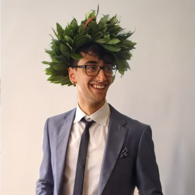

<article>

<header>
    <h3>Kasper Munch</h3>
    
<b>PI</b> - kaspermunch@birc.au.dk

</header>

I apply population genomic analysis and modelling to understand the fundamental properties and mechanisms of selection, recombination, and speciation. Model organisms are mostly humans and other primates.

</article>

<article>

<header>
    <h3>Shannon D'Urso</h3>
    
Postdoc

</header>

Shannon works on how intra-genomic conflicts in spermatogenesis shape the genetic basis of autism.

</article>

<article>

<header>
    <h3>Johan Christensen Ulstrup</h3>
    
Master student

</header>

Johan uses genomic pre-trained networks to compare sequence X chromosome sequence conservation across baboon species.

</article>

<!-- 

## Former members

<article>

<header>
    <h3>Søren Jørgensen</h3>
    
Master student

</header>

Søren works on chromatin architecture spermatogenesis and its relation to selection on the X chromosome.

</article>

<article>

<header>
    <h3>Erik Fogh Sørensen</h3>
    
PhD student

</header>

Erik works on how intragenomic conflicts shape X chromosome evolution and the development of hybrid incompatibilities between diverging populations.

</article>

<article>

<header>
    <h3>Ariadna Saez Gomez</h3>
    
Intern

</header>

Ariadna worked on identifying genomic elements responsible for strong selection on the X chromosome.

</article>

<article>

<header>
    <h3>Davide Capozzi</h3>
    
Intern

</header>

Davide worked on the dynamics of meiotic drive and on identifying signature patterns in genetic diversity for its identification.

</article>

<article>

<header>
    <h3>Tobias Røikjer</h3>
    
Master student

</header>

Tobias worked on a graph-based formulation of phase-type distributions to compute the joint distribution of total branch length of lineages with different numbers of descendants and to compute the joint distribution of the site frequency spectrum in both a single population and in an isolation-with-migration model.

</article>

<article>

<header>
    <h3>David Castellano</h3>
    
Postdoc

</header>

David was funded by Independent Research Fund Denmark. He worked on distributions of fitness effects and the determinants of genetic variation across the genomes of great apes.

</article>

<article>

<header>
    <h3>Jonas Berglund</h3>
    
Postdoc

</header>

Jonas worked on GC-biased gene conversion and stability of hotspots in birds.

</article>
-->
