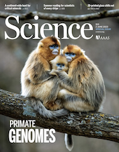
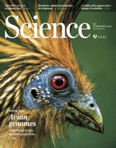
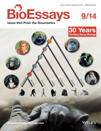

Authors from our group underlined

<!-- Jonas bird paper -->

<strong>Viruses rule over adaptation in conserved human proteins</strong> 
Castellano D, Uricchio LH, Munch K, Enard D
<a href="https://www.science.org/doi/10.1126/science.abn8153"><strong>BioRxiv</strong></a>

<strong>Versatile detection of diverse selective sweeps with Flex-sweep</strong> 
 Lauterbur E,  Munch K, Enard 
<a href="https://academic.oup.com/mbe/article/40/6/msad139/7194669"><strong>Molecular Biology and Evolution</strong> (2023) </a>

<!--  -->
<strong>Genome-wide coancestry reveals details of ancient and recent male-driven reticulation in baboons</strong> 
Sørensen EF, Harris RA, Zhang L, Raveendran M, Kuderna LFK, Walker JA, Storer JM, Kuhlwilm M, Fontsere C, Seshadri L, Bergey CM, Burrell AS, Bergmann J,Phillips-Conroy JE, Shiferaw F, Chiou KL, Chuma IS, Keyyu JD, Fischer J, Gingras MC, Salvi S, Doddapaneni H, Schierup MH, Batzer MA, Jolly CJ, Knauf S, Zinner D, Farh KKH, Marques-Bonet T, Munch K, Roos C, Rogers J 
<a href="https://"><strong>Science</strong> (2023) </a>

<!--  -->
<strong>Pervasive incomplete lineage sorting illuminates speciation and selection processes in primates</strong> 
Rivas-González I, Rousselle M, Li F, Zhou L, Dutheil JY, Munch K, Shao Y, Wu D, Schierup MH, Zhang G 
<a href="https://"><strong>Science</strong> (2023) </a>

<strong>Extraordinary selection on the human X chromosome associated with archaic admixture</strong> 
Skov L, Macià MC Lucotte EA, Cavassim MIA, Castellano D, Schierup MH, Kasper Munch 
<a href="https://www.cell.com/cell-genomics/fulltext/S2666-979X(23)00034-4"><strong>Cell Genomics</strong> (2023)</a>

<strong>Graph-based algorithms for phase-type distributions</strong> 
Røikjer T, Hobolth A,
Munch K 
<a href="https://link.springer.com/article/10.1007/s11222-022-10174-3"><strong>Statistics and Computing</strong> (2022) </a>

<strong>Genomic analysis of the domestication and post-Spanish conquest evolution of the llama and alpaca</strong> 
Fan R, Gu Z, Guang X, Marín JC, Varas V, Gonzalez B, Wheeler JC, Hu Y, Li E, Sun X, Yang X, Zhang C, Gao W, He J, Munch K, Corbett-Detig R, Barbato M, Pan S, Zhan X, Bruford M, Dong C 
<a href="https://genomebiology.biomedcentral.com/articles/10.1186/s13059-020-02080-6"><strong>Genome Biology</strong> (2020) </a>

<strong>Population genomics in the great apes (book chapter)</strong> 
Castellano C Munch K 
<a href="https://link.springer.com/book/10.1007/978-1-0716-0199-0"><strong>Statistical Population Genetics, Springer</strong>&nbsp;(2020)</a>

<strong>Impact of mutation rate and selection at linked sites on DNA variation across the genomes of humans and other homininae</strong> 
Castellano D, Eyre-Walker A, Munch K 
<a href="https://academic.oup.com/gbe/advance-article/doi/10.1093/gbe/evz215/5584269"><strong>Genome Biology and Evolution</strong> (2019)</a>

<strong>Comparison of the full distribution of fitness effects of new amino acid mutations across great apes</strong> 
Castellano D, Macià MC, Tataru P, Bataillon T, Munch K 
<a href="https://www.genetics.org/content/early/2019/09/05/genetics.119.302494.long"><strong>Genetics</strong> (2019)</a>

<strong>Alu insertion polymorphisms shared by Papio baboons and Theropithecus gelada reveal an intertwined common ancestry</strong> 
Walker JA, Jordan VE, Storer JM, Steely CJ, Gonzalez-Quiroga P, Beckstrom TO, Rewerts LC, St Romain CP, Rockwell CE, Rogers J, Jolly CJ, Konkel MK, Batzer MA, Harris RA, Raveendran M, Liu Y, Murali S, Vilgalys TP, Thomas GWC, Pagel KA, Pejaver V, Catacchio CR, Archidiacono N, Ventura M, Marra-Campanale A, Palazzo A, Capozzi O, Raja A, Huddleston J, Quick VS, Karimpour-Fard A, Schrempf D, de Manuel Montero M, Billis K, Martin FJ, Muffato M, Athanasiadis G, Bergey C, Burrell A, Cheng J, Cox L, Else J, Han Y, Kopp GH, Kothe M, Leppala K, Noll A, Pecotte J, Pipes L, Rice K, Mason CE, Disotell T, Phillips-Conroy J, Walter L, Munch K, Mailund T, Schierup M, Kosiol C, Vinar T, Sikela JM, Zinner D, Roos C, Radivojac P, Stanyon R, Rocchi M, Eichler EE, Aken B, Hahn MW, Marques-Bonet T, Tung J, Muzny DM, Gibbs RA, Worley KC 
<a href="https://mobilednajournal.biomedcentral.com/articles/10.1186/s13100-019-0187-y"><strong>Mobile DNA</strong> (2019)</a>

<strong>The comparative genomics and complex population history of <em>Papio</em> baboons</strong> 
Rogers J, Raveendran M, Harris A, Mailund T, Leppälä K, Athanasiadis G, Schierup MH, Cheng J, Munch K, Walker JA, Konkel MK, Jordan V, Steely CJ, Beckstrom TO, Bergey C, Burrell A, Schrempf D, Noll A, Kothe M, Kopp GH, Liu Y, Murali A, Billis K, Martin FJ, Muffato M, Cox L, Else J, Disotell T, Muzny DM, Phillips-Conroy J, Aken B, Eichler EE, Marques-Bonet T, Kosiol C, Batzer MA, Hahn MW, Tung J, Zinner D, Roos C, Jolly CJ, Gibbs RA, Worley KC, and the Baboon Genome Analysis Consortium 
<a href="http://advances.sciencemag.org/content/5/1/eaau6947"><strong>Science Advances</strong> (2019)</a>

<strong>Dynamic Copy Number Evolution of X- and Y-Linked Ampliconic Genes in Human Populations</strong> 
Lucotte EA, Skov L, Jensen JM, Macià MC, Munch K, Schierup MH 
<a href="https://www.ncbi.nlm.nih.gov/pubmed/29769284"><strong>Genetics</strong> (2018)</a>

<strong>A computational reconstruction of <em>Papio</em> phylogeny using Alu insertion polymorphisms</strong> 
Jordan VE, Walker JA, Beckstrom TO, Steely CJ, McDaniel CL, St. Romain CP, The Baboon Genome Analysis Consortium, Worley KC, Phillips-Conroy J, Jolly CJ, Rogers J, Konkel MK, Batzer MA 
<a href="https://mobilednajournal.biomedcentral.com/articles/10.1186/s13100-018-0118-3"><strong>Mobile DNA</strong> (2018)</a>

<strong>Analysis of lineage-specific Alu subfamilies in the genome of the olive baboon, <em>Papio anubis</em></strong> 
Steely CJ, Baker JN, Walker JA, Loupe III CD, The Baboon Genome Analysis Consortium, Batzer MA 
<a href="https://mobilednajournal.biomedcentral.com/articles/10.1186/s13100-018-0115-6"><strong>Mobile DNA</strong> (2018)</a>

<strong>A comprehensive genomic history of extinct and living elephants</strong> 
Palkopoulou E, Lipson M, Mallick S, Nielsen S, Rohland N, Baleka S, Karpinski E, Ivancevic AM, To TH, R. Kortschak D, Raison JM, Qu Z, Chin TJ, Alt KW, Claesson S, Dalén L, MacPhee RDE, Meller H, Roca AL, Ryder OA, Heiman D, Young S, Breen M, Williams C, Aken BL, Ruffier M, Karlsson E, Johnson J, Palma FD, Alfoldi J, Adelson DL, Mailund T, Munch K, Lindblad-Toh K, Hofreiter M, Poinar H, Reich D 
<a href="http://www.pnas.org/content/early/2018/02/16/1720554115"><strong>PNAS</strong> (2018)</a>

<strong>Evidence that the Rate of Strong Selective Sweeps Increases with Population Size in the Great Apes</strong> 
Nam K, Munch K, Mailund T, Nater A, Greminger M, Krützen M, Marquès-Bonet T, Schierup MH 
<a href="http://www.pnas.org/content/early/2017/01/25/1605660114.full.pdf?sid=9c738bfe-20ef-4739-9831-eb395b70332f"><strong>PNAS</strong>&nbsp;(2017)</a>

<strong>Alu insertion polymorphisms as evidence for population structure in baboons</strong> 
Steely CJ, Walker JA, Jordan VE, Beckstrom TO, McDaniel CL, St Romain CP, Bennett EC, Robichaux A, Clement BN, Raveendran M, Worley KC, Phillips-Conroy J, Jolly CJ, Rogers J, Konkel MK, Batzer MA, Liu Y, Murali S, Vilgalys TP, Walker JA, Konkel MK, Jordan VE, Steely CJ, Beckstrom TO, Thomas GWC, Pagel KA, Pejaver V, Catacchio CR, Archidiacono N, Ventura M, Marra-Campanale A, Palazzo A, Capozzi O, Raja A, Huddleston J, Quick VS, Karimpour-Fard A, Schrempf D, de Manuel Montero M, Billis K, Martin FJ, Muffato M, Athanasiadis G, Bergey C, Burrell A, Cheng J, Cox L, Else J, Han Y, Kopp GH, Kothe M, Leppala K, Noll A, Pecotte J, Pipes L, Rice K, Mason CE, Disotell T, Phillips-Conroy J, Walter L, Munch K, Mailund T, Schierup M, Kosiol C, Vinar T, Sikela JM, Zinner D, Roos C, Jolly CJ, Radivojac P, Stanyon R, Rocchi M, Eichler EE, Aken B, Hahn MW, Batzer MA, Marques-Bonet T, Tung J, Muzny DM, Gibbs RA, Worley KC 
<a href="https://academic.oup.com/gbe/article/9/9/2418/4107939"><strong>Genome Biology and Evolution</strong>&nbsp;(2017)</a>

<strong>Papio baboon species indicative Alu elements</strong> 
Walker JA, Jordan VE, Steely CJ, Beckstrom TO, McDaniel CL, St Romain CP, Bennett EC, Robichaux A, Clement BN, Konkel MK, Batzer MA, Rogers J, Harris RA, Raveendran M, Liu Y, Murali S, Vilgalys TP, Walker JA, Konkel MK, Jordan VE, Steely CJ, Beckstrom TO, Thomas GWC, Pagel KA, Pejaver V, Catacchio CR, Archidiacono N, Ventura M, Marra-Campanale A, Palazzo A, Capozzi O, Raja A, Huddleston J, Quick VS, Karimpour-Fard A, Schrempf D, de Manuel Montero M, Billis K, Martin FJ, Muffato M, Athanasiadis G, Bergey C, Burrell A, Cheng J, Cox L, Else J, Han Y, Kopp GH, Kothe M, Leppala K, Noll A, Pecotte J, Pipes L, Rice K, Mason CE, Disotell T, Phillips-Conroy J, Walter L, Munch K, Mailund T, Schierup M, Kosiol C, Vinar T, Sikela JM, Zinner D, Roos C, Jolly CJ, Radivojac P, Stanyon R, Rocchi M, Eichler EE, Aken B, Hahn MW, Batzer MA, Marques-Bonet T, Tung J, Muzny DM, Gibbs RA, Worley KC 
<a href="https://academic.oup.com/gbe/article/9/6/1788/3965007"><strong>Genome Biology and Evolution</strong>&nbsp;(2017)</a>

<strong>Selective Sweeps across Twenty Million Years of Primate Evolution</strong> 
 Munch K, Nam K, Schierup MH, Mailund M 
<a href="http://mbeoxfordjournalsorg/content/33/12/3065"><strong>Molecular Biology and Evolution</strong>&nbsp;(2016)</a>

<strong>Strong selective sweeps on the X chromosome in the human-chimpanzee ancestor explain its low divergence</strong> 
Dutheil JY, Munch K, Nam K, Mailund T, Schierup MH 
<strong><a href="http://journals.plos.org/plosgenetics/article?id=10.1371/journal.pgen.1005451">PLoS Genetics</a></strong><a href="http://journals.plos.org/plosgenetics/article?id=10.1371/journal.pgen.1005451"> (2015)</a>

<strong>Extreme selective sweeps independently targeted the X chromosomes of the great apes</strong> 
Nam K, Munch, K, Hobolth, A, Dutheil JY, Veeramah K, Woerner A, Hammer MH, Great Ape Diversity Project, Mailund T, Schierup MH. 
<a href="http://www.pnas.org/content/112/20/6413.abstract"><strong>PNAS</strong>&nbsp;(2015)</a>

<strong>Inference of purifying and positive selection in three subspecies of chimpanzees (Pan troglodytes) from exome sequencing</strong> 
Bataillon T, Duan J, Hvilsom C, Jin X, Li X, Skov L, Glemin S, Munch K, Jiang T, Qian Y, Hobolth A, Wang J, Mailund T, Siegismund HR, Schierup MH. 
<a href="http://www.ncbi.nlm.nih.gov/pubmed/25829516"><strong>Genome Biology and Evolution</strong>&nbsp;(2015)</a>

<strong>The Time-Scale Of Recombination Rate Evolution In Great Apes</strong> 
Stevison LS, Woerner AE, Kidd JM, Kelley JL, Veeramah KR, McManus KF, Great Ape Genome Project, Bustamante CD, Hammer MF, Wall JD 
<b><a href="http://mbe.oxfordjournals.org/content/33/4/928">Molecular Biology and Evolution</a></b><a href="http://mbe.oxfordjournals.org/content/33/4/928"> (2015)</a>

<!--  -->
<strong>Whole Genome Analyses Resolve Early Branches in the Tree of Life of Modern Birds</strong> 
Jarvis ED, Mirarab S, Aberer AJ, Li B, Houde P, Li C, Ho SYW, Faircloth BC, Nabholz B, Howard JT, Suh A, Weber CC, Fonseca RRd, Li J, Zhang F, Li H, Zhou L, Narula N, Liu L, Ganapathy G, Boussau B, Bayzid MdS, Zavidovych V, Subramanian S, Gabaldón T, Capella-Gutiérrez S, Huerta-Cepas J, Rekepalli B, Munch K, Schierup M, Lindow B, Warren WC, Ray D, Green RE, Bruford M, Zhan X, Dixon A, Li S, Li N, Huang Y, Derryberry EP, Bertelsen MF, Sheldon FH, Brumfield RT, Mello CV, Lovell PV, Wirthlin M, Schneider MPC, Prosdocimi F, Samaniego JA, Velazquez AMV, Alfaro-Núñez A, Campos PF, Petersen B, Sicheritz-Ponten T, Pas A, Bailey T, Scofield P, Bunce M, Lambert DM, Zhou Q, Perelman R, Driskell AC, Shapiro B, Xiong Z, Zeng Y, Liu S, Li Z, Liu B, Wu K, Xiao J, Yinqi X, Zheng Q, Zhang Y, Yang H, Wang J, Smeds L, Rheindt FE, Braun M, Fjeldsa J, Orlando L, Barker K, Jønsson KA, Johnson W, Koepfli KP, OBrien S, Haussler D, Ryder OA, Rahbek C, Willerslev E, Graves GR, Glenn TC, McCormack J, Burt D, Ellegren H, Alström P, Edwards SW, Stamatakis A, Mindell DP, Cracraft J, Braun EL, Warnow T, Jun W, Gilbert MTP, Zhang G 
<a href="http://www.sciencemag.org/content/346/6215/1320.abstract"><strong>Science</strong> (2014)</a>

<strong>Lineage Sorting in Apes</strong> 
Mailund T, Munch K, Schierup MH 
<a href="http://www.annualreviews.org/doi/abs/10.1146/annurev-genet-120213-092532"><strong>Annual review of genetics</strong>&nbsp;(2014)</a>

<strong>Genomic footprints of speciation in Atlantic eels (Anguilla anguilla and A. rostrata)</strong> 
Jacobsen LMW, Pujolar JM, Bernatchez L, Munch K, Jian J, Niu Y, Hansen MM. 
<a href="http://onlinelibrary.wiley.com/doi/10.1111/mec.12896/abstract"><strong>Molecular Ecology</strong>&nbsp;(2014)</a>

<!--  -->
<strong>Unraveling recombination rate evolution using ancestral recombination maps&nbsp;</strong> 
Munch K, Schierup MH, Mailund T 
<a href="http://doi.wiley.com/10.1002/bies.201400047"><strong>BioEssays</strong>&nbsp;(2014)</a>

<strong>Genome-wide single generation signatures of local selection in the panmictic European eel</strong> 
Pujolar JM, Jacobsen LMW, Als TD, Frydenberg J, Munch K, Jonsson B, Jian JB, Cheng L, Maes GE, Bernatchez L, Hansen MM 
<a href="http://onlinelibrary.wiley.com/doi/10.1111/mec.12753/abstract"><strong>Molecular Ecology</strong>&nbsp;(2014)</a>

<strong>A fine-scale recombination map of the human–chimpanzee ancestor reveals faster change in humans than in chimpanzees and a strong impact of GC-biased gene conversion</strong> 
Munch K, Mailund T, Dutheil JY, Schierup MH 
<a href="http://genome.cshlp.org/content/24/3/467"><strong>Genome&nbsp;</strong><b>Research</b>&nbsp;(2014)</a>

<strong>Inferring the Process of Human–Chimpanzee Speciation</strong> 
Mailund T, Munch K, Schierup MH 
<a href="http://onlinelibrary.wiley.com/doi/10.1002/9780470015902.a0020833.pub2/full"><strong>Wiley Online Library</strong> (2014)</a>

<strong>Rates and patterns of great ape retrotransposition</strong> 
Formozdiari F, Konkelb MK, Prado-Martinez J, Chiatanted G, Herraez IH, Walker JA, Nelson B, Alkan C, Sudmant PH, Huddleston J, Catacchio CR, Ko A, Malig M, Baker C, Great Ape Genome Project, Marques-Bonet T, Ventura M, Batzer MA, Eichler EE 
<a href="http://www.pnas.org/content/110/33/13457.long"><strong>PNAS</strong>&nbsp;(2013)</a>

<strong>Great ape genetic diversity and population history</strong> 
Prado-Martinez J, Sudmant PH, Kidd JM, Li H, Kelley JL, Lorente-Galdos B,&nbsp;Veeramah KR, Woerner AE, O’Connor TD, Santpere G, Cagan A, Theunert C, Casals F, Laayouni H, Munch K, Hobolth A, Halager AE, Malig M,&nbsp;Hernandez-Rodriguez J, Hernando-Herraez I, Prufer K, Pybus M, Johnstone L, Lachmann M, Alkan C, Twigg D, Petit N, Baker C, Hormozdiari F, Fernandez-Callejo M, Dabad M, Wilson ML, Stevison L, Camprubi C, Carvalho T, Ruiz-Herrera A, Vives L, Mele1 M, Abello T, Kondova I, Bontrop RE, Pusey A, Lankester F, Kiyang JA, Bergl RA, Lonsdorf E, Myers A, Ventura M, Gagneux P, Comas D, Siegismund H, Blanc J, Agueda-Calpena L, Gut M, Fulton L, Tishkoff SA, Mullikin JC, Wilson RK, Gut IG, Gonder MK, Ryder OA, Hahn BH, Navarro A, Akey JM, Bertranpetit J, Reich D, Mailund T, Schierup MH, &nbsp;Hvilsom C, Andres AM, Wall JD,&nbsp;Bustamante CD, Hammer MF, Eichler EE, Marques-Bonet T 
<a href="http://www.nature.com/nature/journal/vaop/ncurrent/full/nature12228.html"><strong>Nature</strong>&nbsp;(2013)</a>

<strong>A New Isolation with Migration Model along Complete Genomes Infers Very Different Divergence Processes among Closely Related Great Ape Species</strong> 
T Mailund, AE Halager, M Westergaard, JY Dutheil, K Munch, LN Andersen, G Lunter, K Prüfer, A Scally, A Hobolth, MH Schierup 
<a href="http://www.plosgenetics.org/article/info:doi/10.1371/journal.pgen.1003125"><strong>PLoS Genetics</strong>&nbsp;(2012)</a>

<strong>The bonobo genome compared with the chimpanzee and human genomes</strong> 
Prüfer K, Munch K, Hellmann I, Akagi K, Miller JR, Walenz B, Koren S, Sutton G, Kodira C, Winer T, Knight JR, Mullikin JC, Meader SJ, Ponting CP, Lunter G, Higashino S, Hobolth A, Dutheil J, Karakoc E, Alkan C, Sajjadian S, Catacchio CR, Ventura M, Marques-Bonet T, Eichler EE, Andre C, Atencia R, Mugisha L, Patterson P, Siebauer M, Good JM, Fischer A, Ptak SE, Lachmann M, Symer D, Mailund T, Schierup MH, Andres AM, Kelso J, Paabo S 
<a href="http://www.nature.com/nature/journal/vaop/ncurrent/full/nature11128.html"><strong>Nature</strong>&nbsp;(2012)</a>

<strong>Extensive X-linked adaptive evolution in central chimpanzees</strong> 
Hvilsoma C, Qianc Y, Bataillonc B, Lid Y, Mailund T, Sallée B, Carlsena F, Lid R, Zhengd R, Jiangd R, Jiangd H, Jind X, Munch K, Hobolth A, Siegismund HR, Wang J, Schierupc MH 
<a href="http://www.pnas.org/content/early/2012/01/18/1106877109.full.pdf"><strong>PNAS</strong>&nbsp;(2012)</a>

<strong>Insights into hominid evolution from the gorilla genome sequence</strong> 
Scally A, Dutheil JY, Hillier LW, Jordan GE, Goodhead I, Herrero J, Hobolth A, Lappalainen T, Mailund T, Marques-Bonet T, McCarthy S, Montgomery SH, Schwalie PC, Tang YA, Ward MC, Xue Y, Yngvadottir B, Alkan C, Andersen LN, Ayub Q, Ball EV, Beal K, Bradley BJ, Chen Y, Clee CM, Fitzgerald S, Graves TA, Gu Y, Heath P, Heger A, Karakoc E, Kolb-Kokocinski A, Laird GK, Lunter G, Meader S, Mort M, Mullikin JC, Munch K, O'Connor TD, Phillips AD, Prado-Martinez J, Rogers AS, Sajjadian S, Schmidt D, Shaw K, Simpson JT, Stenson PD, Turner DJ, Vigilant L, Vilella AJ, Whitener W, Zhu B, Cooper DN, de Jong P, Dermitzakis ET, Eichler EE, Flicek P, Goldman N, Mundy NI, Ning Z, Odom DT, Ponting CP, Quail MA, Ryder OA, Searle SM, Warren WC, Wilson RK, Schierup MH, Rogers J, Tyler-Smith C, Durbin R 
<a href="http://www.nature.com/nature/journal/v483/n7388/full/nature10842.html"><strong>Nature</strong> (2011)</a>

<strong>Species-specific responses of Late Quaternary megafauna to climate and humans</strong> 
Lorenzen ED, Nogués-Bravo D, Orlando L, Weinstock J, Binladen J, Marske KA, Ugan A, Borregaard MK, Gilbert MT, Nielsen R, Ho SY, Goebel T, Graf KE, Byers D, Stenderup JT, Rasmussen M, Campos PF, Leonard JA, Koepfli KP, Froese D, Zazula G, Stafford TW Jr, Aaris-Sørensen K, Batra P, Haywood AM, Singarayer JS, Valdes PJ, Boeskorov G, Burns JA, Davydov SP, Haile J, Jenkins DL, Kosintsev P, Kuznetsova T, Lai X, Martin LD, McDonald HG,
Mol D, Meldgaard M, Munch K, Stephan E, Sablin M, Sommer RS, Sipko T, Scott E, Suchard MA, Tikhonov A, Willerslev R, Wayne RK, Cooper A, Hofreiter M, Sher A, Shapiro B, Rahbek C, Willerslev E 
<a href="http://www.nature.com/nature/journal/v479/n7373/full/nature10574.html"><strong>Nature</strong>&nbsp;(2011)</a>

<strong>Ancient DNA reveals late survival of mammoth and horse in interior Alaska</strong> 
Haile J, Froese D, MacPhee R, Roberts R, Arnold L, Alberto R, Rasmussen M, Nielsen R, Brook B, Robinson S, Demuro M, Gilbert TM, Munch K, Austin J, Cooper A, Barnes I, Moller P, Willerslev E 
<a href="http://www.pnas.org/content/early/2009/12/16/0912510106.abstract"><strong>PNAS</strong>&nbsp;(2009)</a>

<strong>'The Farm Beneath the Sand' - an archaelogical case study on ancient 'dirt' DNA</strong> 
Hebsgaard MB, Gilbert MTP, Arneborg J, Heyn, P, Allentoft ME, Bunce M, Munch K, Schweger C, Willerslev E 
<a href="http://antiquity.ac.uk/ant/083/320/default.htm"><strong>Antiquity</strong> (2009)</a>

<strong>Non-Destructive Sampling of Ancient Insect DNA</strong> 
Thomsen PF, Elias S, Gilbert MTP, Haile J, Munch K, Kuzmina S, Froese DG, Sher A, Holdaway RN, Willerslev E 
<a href="http://www.plosone.org/article/info%3Adoi%2F10.1371%2Fjournal.pone.0005048"><strong>PLoS ONE</strong>&nbsp;(2009)</a>

<strong>Fast Phylogenetic DNA barcoding</strong> 
Munch K, Boomsma W, Willerslev E, Nielsen R 
<a href="http://rstb.royalsocietypublishing.org/content/363/1512/3997.full"><strong>Phil. Trans. R. Soc. B</strong> (2008)</a>

<strong>Statistical Assignment of DNA Sequences using Bayesian Phylogenetics</strong> 
Munch K, Boomsma W, Huelsenbeck J P, Willerslev E, Nielsen N 
<a href="http://www.informaworld.com/smpp/content~content=a904007579~db=all~tab=content~order=page"><strong>Systematic Biology</strong> (2008)</a>

<strong>nGASP - the nematode genome annotation assessment project</strong> 
Avril Coghlan,Tristan J Fiedler, Sheldon J McKay, Paul Flicek, Todd W Harris, 
Darin Blasiar, _The nGASP Consortium_ and Lincoln D Stein 
<a href="http://www.biomedcentral.com/1471-2105/9/549"><strong>BMC Bioinformatics</strong>&nbsp;(2008)</a>

<strong>Ancient Bacteria Show Evidence of DNA Repair</strong> 
Johnson SS, Hebsgaard MB, Christensen T, Mastepanov M, Zuber MT, Nielsen R, Munch K, Brand T, Gilbert MTP, Bunce M, Ronn R, Gilichinsky D, Froese D, Willerslev E 
<a href="http://www.pnas.org/cgi/content/abstract/0706787104v1"><strong>PNAS</strong>&nbsp;(2007)</a>

<strong>Ancient DNA Chronology within Sediment Deposits: Are Paleobiological Reconstructions 
Possible and is DNA Leaching a Problem?</strong> 
Haile J, Holdaway R, Oliver K, Bunce M, Gilbert MT, Nielsen R, Munch K, Ho SY, Shapiro B, Willerslev E 
<a href="http://mbe.oxfordjournals.org/cgi/content/abstract/24/4/982"><strong>Molecular Biology Evolution</strong>&nbsp;(2007)</a>

<strong>Automatic Generation of Gene Finders for Eukaryotic Species</strong> 
Munch K and Krogh A 
<a href="http://www.biomedcentral.com/1471-2105/7/263"><strong>BMC Bioinformatics</strong>&nbsp;(2006)</a>

<strong>A hidden Markov model approach for determining expression from genomic tiling micro arrays</strong> 
Munch K, Gardner PP, Arctander P, and Krogh A 
<a href="http://www.biomedcentral.com/1471-2105/7/239/abstract"><strong>BMC Bioinformatics</strong>&nbsp;(2006)</a>

