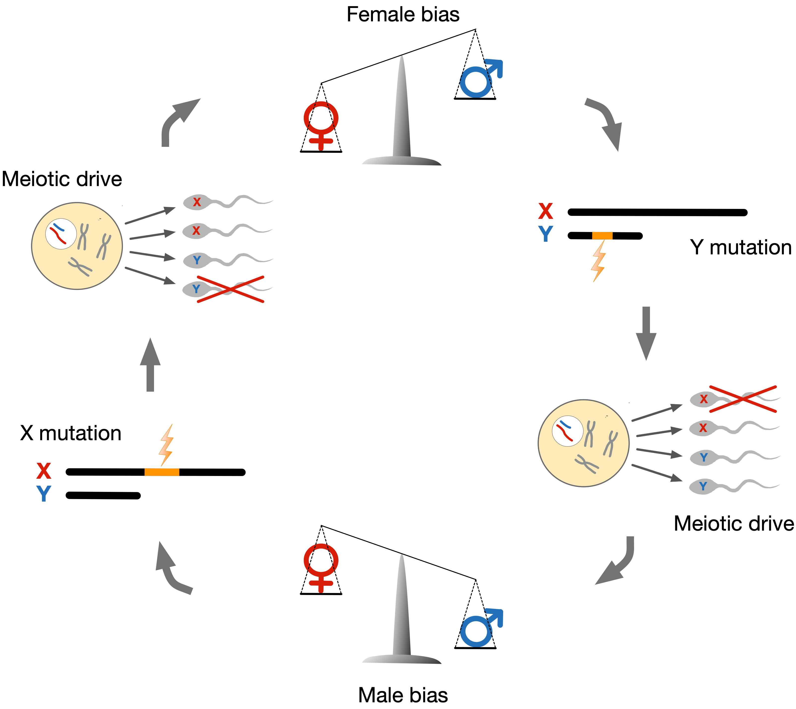
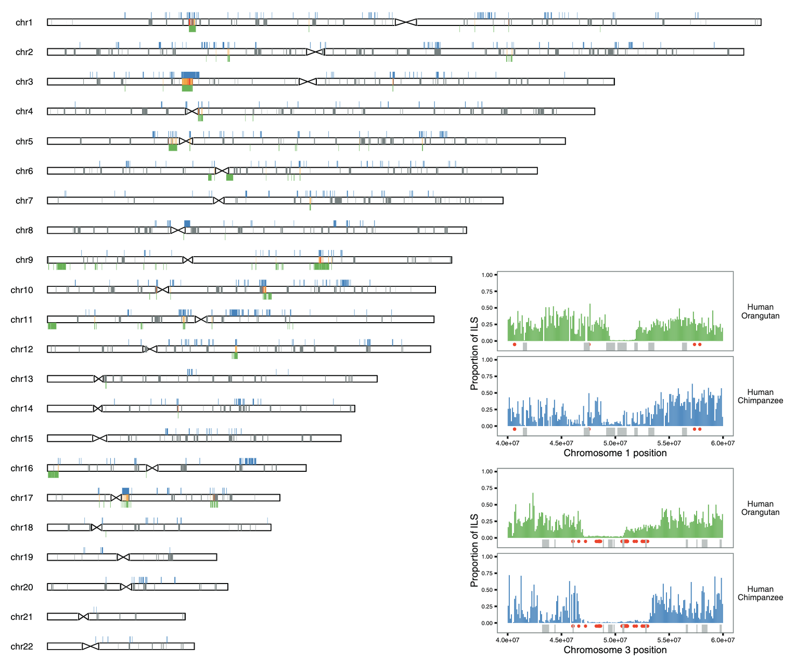

## Sex chromosomes and Autism

{: .img-right}

The number of children diagnosed with autism has surged to 1 in 36 in the past decade. Accurate diagnosis and adequate support will require a thorough understanding of autism's genetic basis. Even though autism affects men and women differently, previous genome-wide association studies (GWAS) have focused on the 22 chromosomes shared by males and females, neglecting the sex chromosomes. We are ramping up an effort to remedy this in collaboration with the Danish iPSYCH consortium. In addition to GWAS tailored to human sex chromosomes, we pursue hypotheses that link sex bias in autism to the unique evolutionary forces acting on sex chromosomes. Recent research from our group has revealed uniquely strong natural selection on the human X chromosome, best explained by selfish X-genes promoting their natural selection in spermatogenesis by killing sperm cells that carry the Y chromosome. Such selfish advantage in spermatogenesis easily trumps modest deleterious effects such gene variants may have on brain development. One in four neuron genes is also expressed in spermatids. We hypothesize that selfish selection for transmission to live sperm promotes gene variants despite a mildly detrimental impact on neuro-development and that female fitness is favored in the subsequent resolution of these collateral effects.

## Sex chromosome meiotic drive

{: .img-right}

In mammals, the X chromosome is present in two copies in females but only one copy in males. In males, the X chromosome instead pairs with a Y chromosome. Unlike other chromosomes, X and Y chromosomes only recombine at the ends of the chromosomes, which allows the X chromosome to evolve independently of the Y chromosome. Because most of the X and Y chromosomes do not recombine, the fate of genes residing on X or Y chromosomes is tied to either the X or Y chromosome. That means an X-linked gene may affect its transmission to the next generation if it can increase the proportion of sperm cells that carry an X chromosome rather than a Y chromosome. Genes may trigger such imbalance by influencing the symmetry of meiosis or killing gametes that carry the other sex chromosomes. Both phenomena are called "meiotic drive" and enable gene variants to induce their natural selection -- even if it reduces the organism's fitness. This insight initially gave rise to the notion of selfish genes. Natural selection, in the form of meiotic drive, will thus actively promote selfish genes, even when these genes unfavorably distort the sex ratio of offspring or harm male fertility. Sex chromosome meiotic drive has been observed in several species, and selfish genes have been identified in fruit flies and mice but not humans. We hypothesize that meiotic drive has been a potent force in the evolution of humans and other primates.

## Identifying episodes of positive natural selection

{: .img-right}

When a strongly selected gene variant displaces all other variants in a population, it sweeps away the genetic variation in a wide genomic region around the gene. Such "sweeps" can be identified through population genetic analysis of large sets of full genomes. However, this approach cannot identify genomic regions subject to sweeps in the species ancestral to humans and other living primates. To this end, we employ methods based on patterns of incomplete lineage sorting, which can identify strong selective sweeps or regions subject to recurrent selective sweeps. An intragenomic conflict between the X and Y chromosomes will fuel an arms race between the two sex chromosomes for transmission to the next generation. This will produce successive bursts of selection that are detectable as sweeps on the X chromosome. We have identified such sweeps across the great ape species tree, and we now analyze genetic diversity across the human X chromosome to find evidence of past episodes of strong selection suggestive of meiotic drive.

## Sex chromosomes and hybrid incompatibility

{: .img-right}

Genetic incompatibilities between incipient species usually first affect the heterogametic sex. For example, X/Y humans are males and Z/W female birds. We hypothesize that meiotic drive may explain this century-old observation dubbed "Haldane's rule." An arms race will cause rapid coevolution of the X and Y chromosomes. Over time, this will lead to an accumulation of reproductive incompatibilities between the X and Y chromosomes of individuals from separated populations. This process would explain not only the widely observed infertility of hybrid XY males. It would also explain the observation that genes on the X chromosome contribute disproportionately to sterility. In humans, it may explain why regions of the X chromosome have resisted introgression from Neanderthals when these interbred with modern humans ~55,000 years ago. The modern human is the only living subspecies of humans. That means we cannot efficiently study the proposed relationship between selfish gene candidates and reduced fertility of human hybrids. However, the evolutionary history and relationship among baboon subspecies resemble that between modern humans and archaic humans such as the Neanderthal. These evolutionary parallels allow us to investigate if meiotic drivers identified in humans are linked to emerging hybrid incompatibility in baboons.
