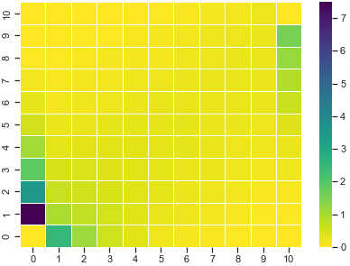
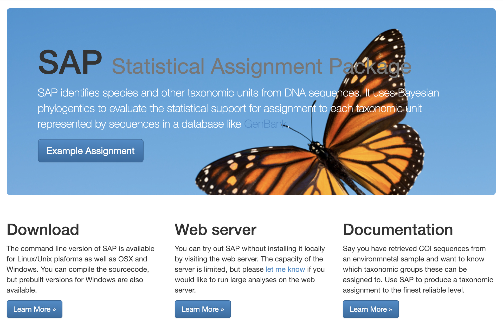

## ptdalgorithms - Efficient algorithms for phase-type distributions

This <a href="https://github.com/TobiasRoikjer/PtDAlgorithms" >software library</a> provides fast and scalable algorithms for constructing and computing properties of for the statistical distributions: continuous and discrete phase-type distributions, rewarded phase-type distributions, and the general multivariate phase-type distributions. The library can compute the moments (e.g. expectation, variance, covariance), the distribution function (pdf, cdf, pmf), the stopping time probability in the Markov jump process or Markov chain, and the distribution function of time-inhomogeneous phase-type distribution, as well as the expectation of rewarded time-inhomogeneous phase-type distributions. The algorithms in the package are emperically multiple orders of magnitude faster than the traditional matrix-based equations for phase-type distributions of matrix inversion, matrix multiplication, and the matrix exponential. It can handle billions of vertices (states) and edges (transitions). The code is written in C, but exposes an interface to both C and R through a C++ layer. The state-space is built as a graph with an easy-to-use API. The state-space is stored efficiently as a graph, taking up very little space compared to using a matrix.The algorithms are fast, graph-based algorithms that operate of this data structure. The state-space can be converted back to a matrix-based format if desired.

## slurm-jupyter - Jupyter on a Slurm cluster

[slurm-jupyter](https://github.com/kaspermunch/slurm-jupyter) lets you run a jupyter notebook in your browser from a compute node on the cluster. This way your analysis runs on the file system where your data is, and you can keep data, code and documentation in one place. slurm_jupyter is a script that starts and connects to a jupyter server on compute note and forwards the web display to your local machine. It only works using the Chrome browser. slurm-jupyter is available as a Conda package [here](https://anaconda.org/kaspermunch/slurm-jupyter).

## SAP – Statistical Assignment Package

The assignment of DNA from organic material to species or taxonomic groups is integral to a number of scientific disciplines. Metagenomics is an approach particularly suitable for viruses and bacterial species, which have a relatively small genome. The approach can be used to characterize environments according to their genetic fingerprint. Even without taking genomic approaches, however, DNA sequencing of selected markers from environmental samples may provide ecological information or identify relevant species such as human pathogens. A related field where unknown specimens are identified based on Cytochrome Oxidase I (COI) has become known as DNA Barcoding. SAP is a tool answer the central question in these fields: what taxonomic group does an unknown organism represented by a DNA sequence belong to? SAP uses a Bayesian approach to calculate a probability distribution over all taxa represented in a sequence database. The probability of assignment to each taxa serves as a measure of confidence in the assignment. SAP is available as both a <a href="https://services.birc.au.dk/sap/downloads">command line tool</a> and a <a href="https://services.birc.au.dk/sap">web service</a>.
 

